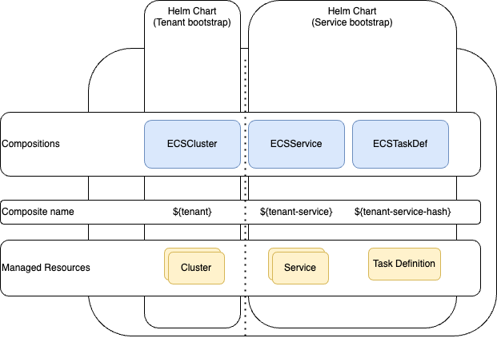

# Crossplane - ECS

This is an example about how to create ECS infrastructure using Crossplane. It creates a Cluster, Service and TaskDefinition resources for simplicity. The goal is to show how to use Crossplane to provision infrastructure and deploy workloads using helm charts on top of Crossplane compositions.

## Architecture

